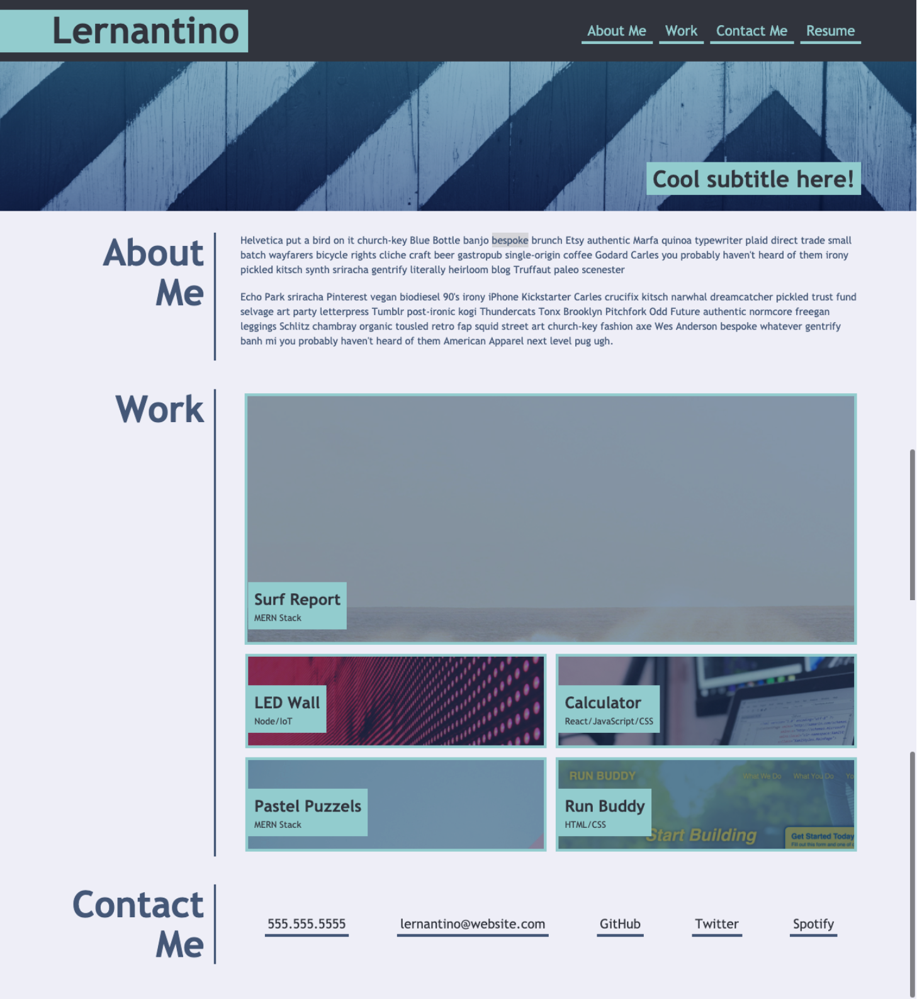
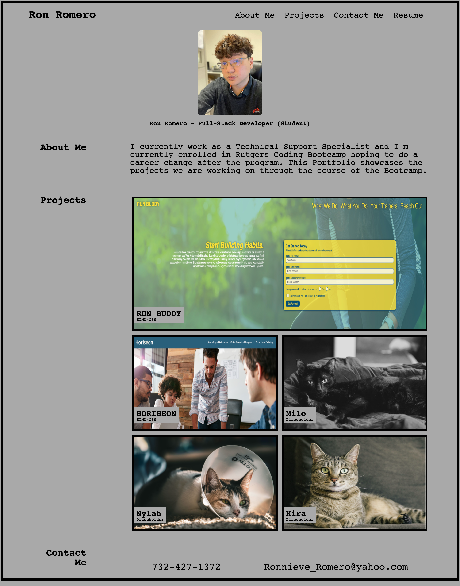

## Ron Romero's Sample Portfolio
Hello! This repository contains code for my sample portfolio which we were tasked to do for Rutgers Coding Bootcamp's second challenge homework.Part of the challenge is making the portfolio have the same structure as the following mock-up image:

This portfolio is meant to showcase our own projects but for now, you can have a look at the projects we've been working on in class!
These projects include Run-Buddy, and Horiseon. Since we've yet to do a lot of projects yet, please enjoy the pictures of my cat as placeholders.
This ReadME and Portfolio will be updated as we progress through the class and eventually make our own applications.

If you are interested in the timeline of bulding this portfolio,[please lick here.](https://github.com/ronnieve23/ronnieve23.github.io/commits/main)

## Visit The Sample Portfolio Here!
https://ronnieve23.github.io/

## Website Screenshot

